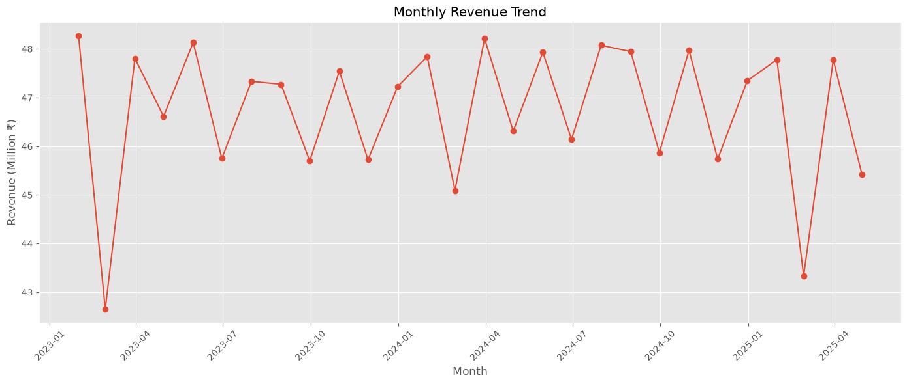
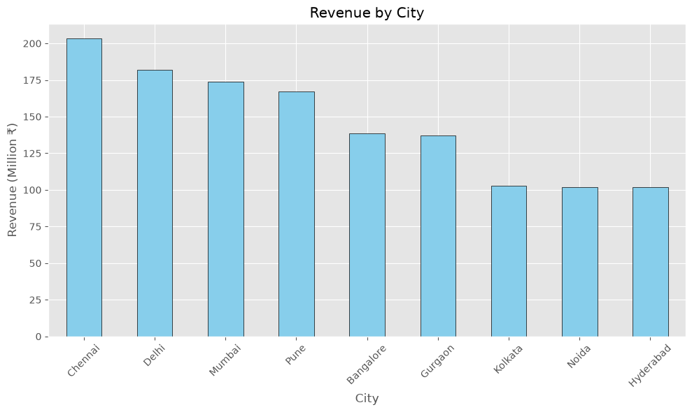
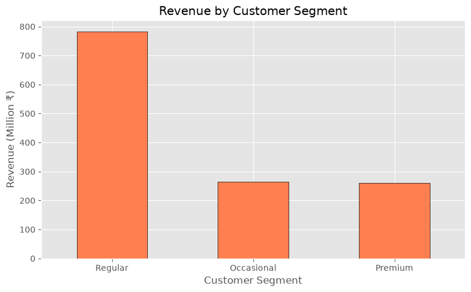
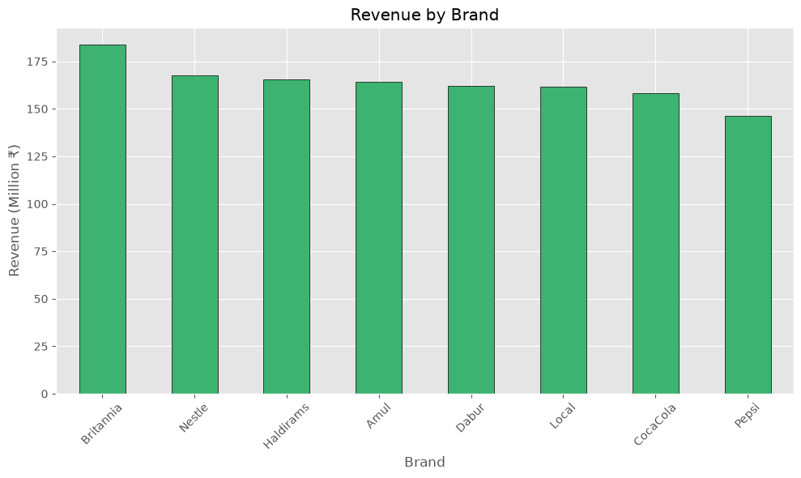
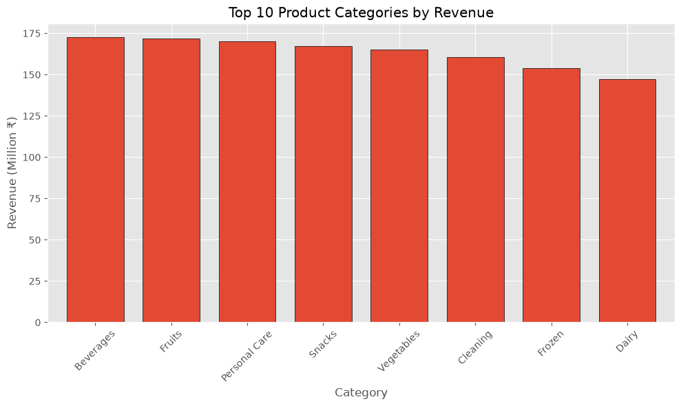
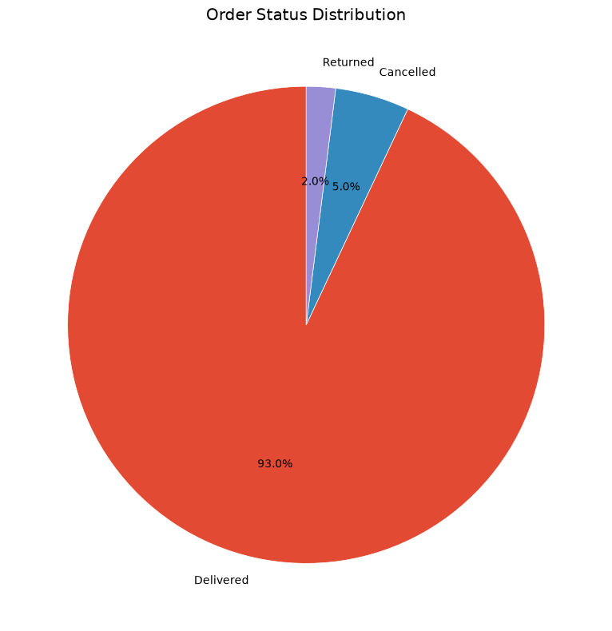
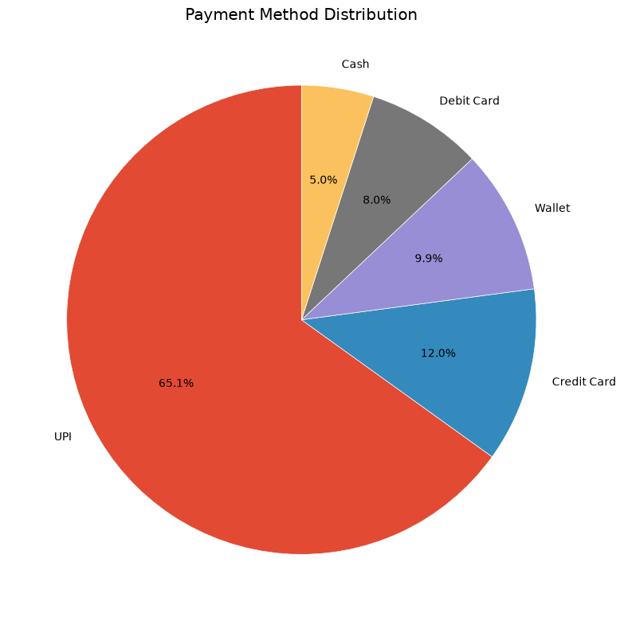
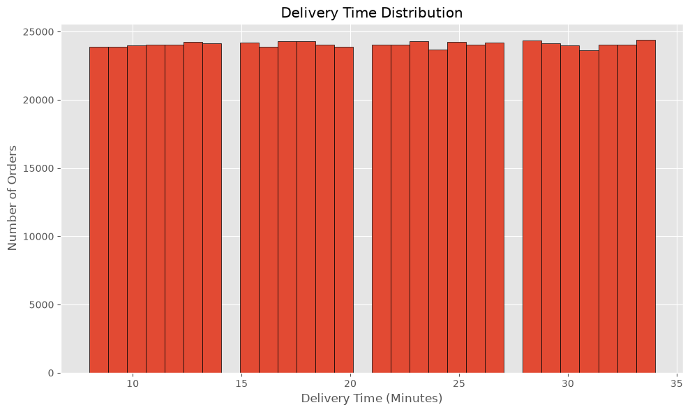
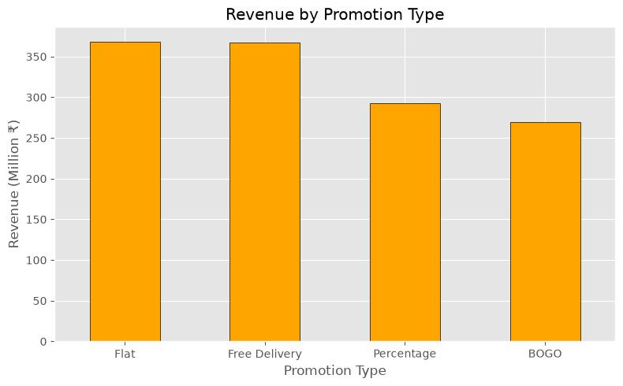
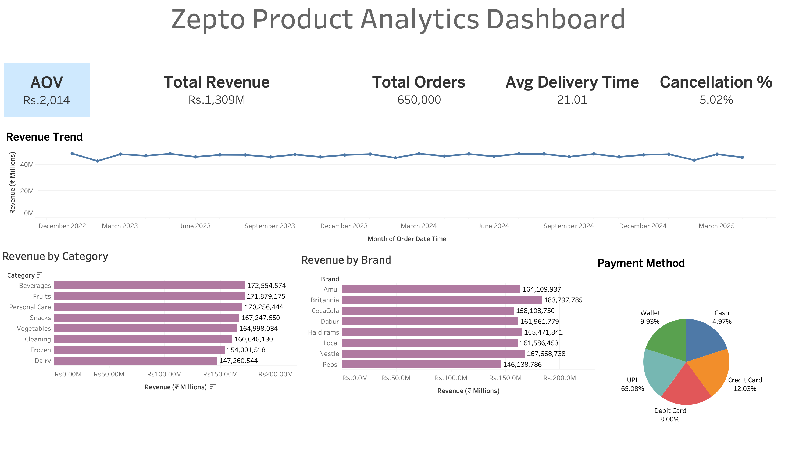

# 🛒 Zepto Product Analytics Dashboard

A complete end-to-end Product Analytics project built using **Python (Pandas & Matplotlib), SQL, and Tableau** to analyze customer orders, revenue, delivery performance, promotions, and payment behavior for a simulated Zepto grocery dataset from Kaggle (real world data may vary, the entire project is for education purpose to study real-world analytics pipeline).

The project demonstrates the complete analytics workflow followed by Product Analysts and Business Analysts—from data cleaning and KPI generation to SQL business analysis and interactive Tableau dashboard creation.

---

# 📌 Project Overview

This project analyzes **650,000+ grocery orders** placed across multiple cities, stores, brands, and payment methods.

The objective was to answer important business questions such as:

- How much revenue is the business generating?
- Which product categories generate maximum revenue?
- Which brands perform the best?
- Are promotions increasing sales?
- What is the average order value?
- What percentage of orders get cancelled?
- Which payment methods are preferred?
- How has revenue changed over time?

The project follows a real-world analytics pipeline:

Raw CSV Files
↓

Python Data Cleaning & Feature Engineering
↓

Exploratory Data Analysis (Pandas + Matplotlib)
↓

SQL Business Analysis
↓

Interactive Tableau Dashboard

---

# 🎯 Business Objective

A Product Analyst at Zepto wants to monitor overall business health by tracking:

- Revenue
- Customer purchasing behaviour
- Order trends
- Delivery performance
- Promotion effectiveness
- Product performance
- Payment preferences

The final deliverable is an interactive Tableau dashboard supported by SQL insights and Python analysis.

---
## 📂 Dataset

This project uses a publicly available retail grocery dataset sourced from **Kaggle** and models a Zepto-like quick commerce business for analytical purposes.

The dataset was used to simulate real-world product analytics workflows, including SQL-based business analysis, exploratory data analysis, KPI development, and dashboard creation.

> **Note:** The dataset is intended for educational and portfolio purposes. Business metrics, customer behavior, and operational insights presented in this project are based on the sample dataset and may not accurately reflect Zepto's actual business performance or internal data.

The project uses multiple relational datasets:

- Customers Information
- Products Information
- Sales Data
- Stores Information
- Promotions Information
- Payments Information

After cleaning and merging, a **Master Dataset** containing over **650,000 records** was created for analysis.

---
# Skills Demonstrated

- Data Cleaning
- Data Wrangling
- Feature Engineering
- Exploratory Data Analysis
- SQL Aggregations
- SQL Window Functions
- SQL Joins
- KPI Development
- Business Analytics
- Dashboard Design
- Data Visualization
- Product Analytics
- Storytelling with Data

---

# 🛠 Tech Stack

| Tool | Purpose |
|-------|----------|
| Python | Data Cleaning & Feature Engineering |
| Pandas | Data Manipulation |
| Matplotlib | Data Visualization |
| SQL | Business Analysis |
| Tableau | Interactive Dashboard |
| VS Code | Development |
| Git & GitHub | Version Control |

---

# 🔄 Project Workflow

## 1. Data Cleaning (Python)

Performed using **Pandas**

### Tasks Performed

- Imported multiple CSV datasets
- Merged relational datasets
- Converted DateTime columns
- Removed duplicate records
- Checked missing values
- Validated null values
- Created Master Dataset
- Generated business features

### Feature Engineering

Created:

- Year
- Month
- Month Name
- Quarter
- Day
- Hour

Created custom business metrics:

- Cancellation Rate
- Delivery Bucket
- Promotion Applied Flag

---

# 📊 Exploratory Data Analysis (Python + Matplotlib)

The following visualizations were created.

---

## Monthly Revenue Trend

Shows revenue growth over time.



---

## Revenue by City

Compares city-wise revenue contribution.



---

## Revenue by Customer Segment

Shows which customer segments generate the highest revenue.



---

## Revenue by Brand

Identifies top-performing brands.



---

## Top Product Categories

Highlights highest revenue generating product categories.



---

## Order Status Distribution

Distribution of completed vs cancelled orders.



---

## Payment Method Distribution

Shows customer payment preferences.



---

## Delivery Time Distribution

Analyzes delivery performance.



---

## Promotion Performance

Measures revenue generated under promotional campaigns.



---

# 🗄 SQL Business Analysis

SQL was used to answer business questions through aggregation, joins and window functions.

## KPI Analysis

Calculated:

- Total Revenue
- Total Orders
- Average Order Value (AOV)
- Average Delivery Time
- Cancellation Rate

---

## Revenue Analysis

Calculated:

- Revenue by Month
- Revenue by Quarter
- Revenue by Year
- Monthly Revenue Trend
- Month-over-month revenue growth
- Running cumulative revenue

---

## Product Analysis

Calculated:

- Revenue by Category
- Revenue by Brand
- Top Selling Products
- Quantity Sold by Product
- Average Selling Price

---

## Customer Analysis

Calculated:

- Revenue by City
- Revenue by Customer Segment
- Orders per Customer
- Repeat Customer Behaviour
- Customer ranking by revenue

---

## Promotion Analysis

Calculated:

- Promotion-wise Revenue
- Promotion Usage
- Promotion Discount
- Promotion Performance

---

## Payment Analysis

Calculated:

- Orders by Payment Method
- Revenue by Payment Method
- Payment Method Share

---

## Delivery Analysis

Calculated:

- Average Delivery Time
- Delivery Time Distribution
- Delivery Performance

---

# 📈 Tableau Dashboard

Built an executive dashboard containing:

### KPI Cards

- Total Revenue
- Total Orders
- Average Order Value
- Average Delivery Time
- Cancellation Rate

### Charts

- Revenue Trend
- Revenue by Category
- Revenue by Brand
- Payment Method Distribution

Dashboard Screenshot



---

# 💡 Key Business Insights

- Generated over **₹1.3 Billion** in revenue.
- Average Order Value is approximately **₹2,014**.
- Cancellation rate remained close to **5%**.
- UPI dominated payment preferences.
- Revenue remained relatively stable across months.
- Certain brands consistently generated higher revenue.
- Product categories contributed almost evenly with slight differences.
- Delivery time averaged around **21 minutes**.

---

# 📁 Folder Structure

```
zepto-product-analytics
│
├── dashboards
│   ├── dashboard.png
│   └── zepto_product_dashboard.twb
│
├── data
│   ├── Customers_Information.csv
│   ├── Master_Dataset.csv
│   ├── Payments_Information.csv
│   ├── Products_Information.csv
│   ├── Promotions_Information.csv
│   ├── Sales_Data.csv
│   └── Stores_Information.csv
│
├── notebooks
│   └── Product_Analytics.ipynb
│
├── sql
│   └── analysis.sql
│
├── visuals
│   ├── deltime.png
│   ├── monthly_revenue.png
│   ├── orderstatusdist.png
│   ├── paymentmethoddistribution.png
│   ├── promtype.png
│   ├── revenuebybrand.png
│   ├── revenuebycity.png
│   ├── revenuebycustomersegment.png
│   └── top10categories.png
│
└── README.md
```

---

# ▶️ How to Run

## Clone Repository

```bash
git clone https://github.com/yourusername/zepto-product-analytics.git
```

---

## Install Dependencies

```bash
pip install pandas matplotlib notebook
```

---

## Run Notebook

```bash
jupyter notebook
```

Open:

```
Product_Analytics.ipynb
```

---

## Open Dashboard

Open

```
zepto_product_dashboard.twb
```

using Tableau Public Desktop.

---

# 🚀 Future Improvements

Possible enhancements include:

- Power BI Dashboard
- Customer Cohort Analysis
- RFM Segmentation
- Customer Lifetime Value (CLV)
- Market Basket Analysis
- Forecasting Revenue using Time Series
- Interactive SQL Dashboard
- Automated ETL Pipeline

---

# 👨‍💻 Author

**Rohan Sharma**

DTU | Civil Engineering

Aspiring Product Analyst | Business Analyst | Data Analyst

Tech Stack:

Python • SQL • Tableau • Excel • Pandas • Matplotlib
